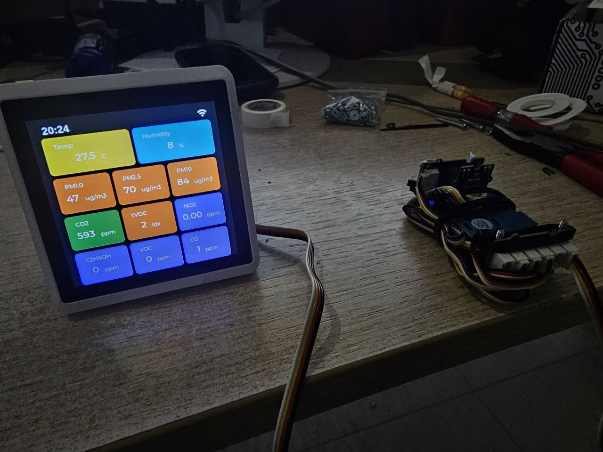
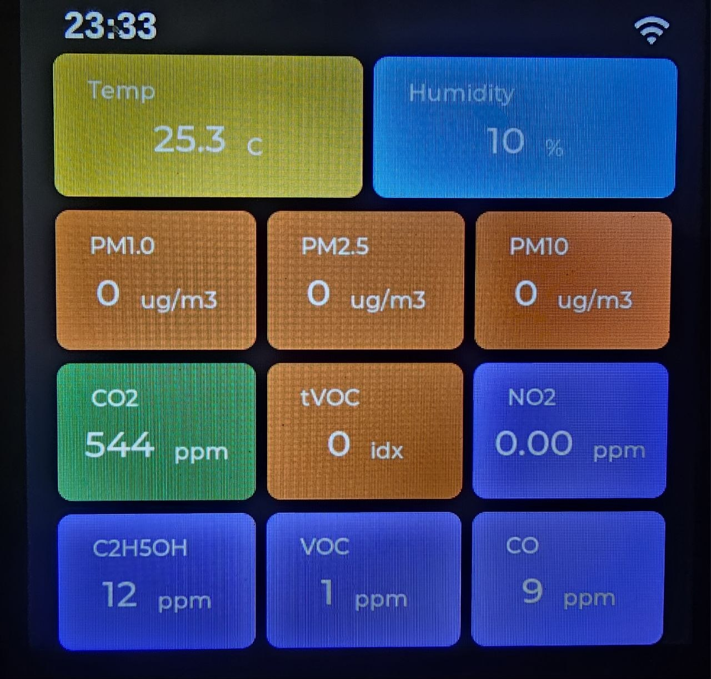
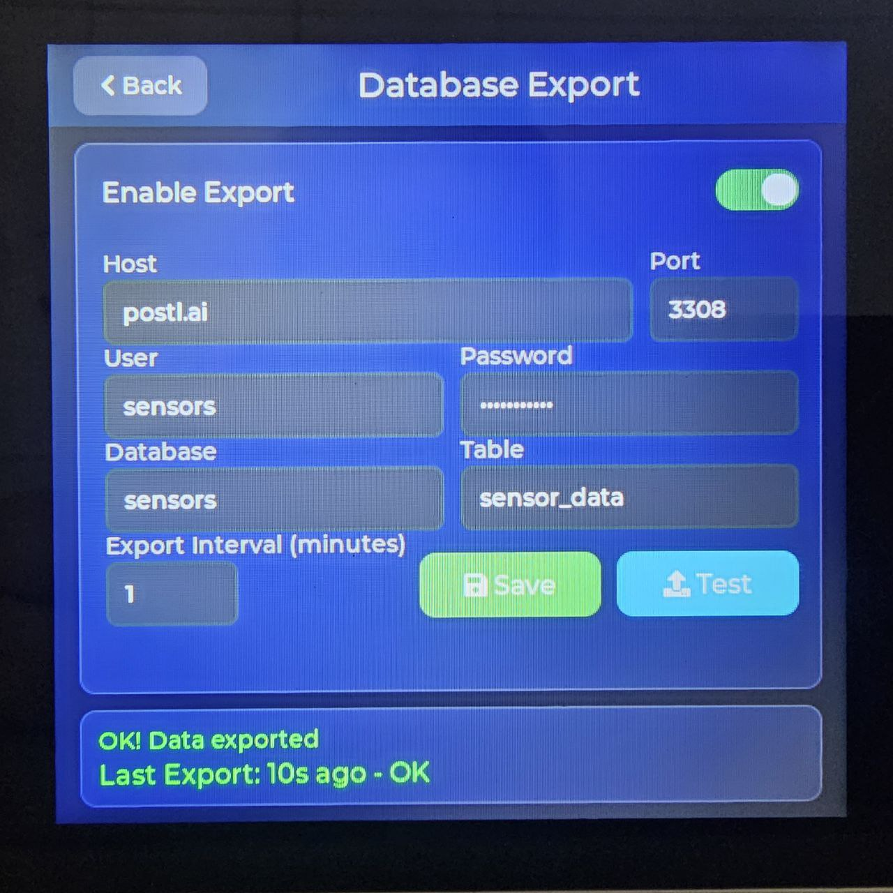

# SenseCAP Indicator RP2040 - Extended Sensor Firmware

Arduino firmware for the RP2040 coprocessor on the SenseCAP Indicator D1S with extended Grove sensor support.

> **Blog Post:** [Building an Advanced Air Quality Monitor with AI-Assisted Programming](https://postl.ai/2026/01/11/building-a-advanced-air-quality-monitor-with-ai-assisted-programming/)

## Photos

### Device with Sensors


### Sensor UI


### MariaDB Export Settings


## Supported Sensors

### Built-in Sensors
- **SCD4x** (I2C 0x62): CO2, Temperature, Humidity
- **SGP40**: TVOC Index (with VOC algorithm)

### Extended Grove Sensors (I2C)
| Sensor | Address | Measurements |
|--------|---------|--------------|
| **Grove HM3301 (HM330X)** | 0x40 | PM1.0, PM2.5, PM10 (ug/m³) |
| **Grove Multichannel Gas V2** | 0x08 | NO2, C2H5OH, VOC, CO |
| **Grove AHT20** | 0x38 | External Temperature, Humidity |

## Wiring

Connect Grove sensors to the I2C Grove port on the SenseCAP Indicator. All sensors share the same I2C bus (SDA: GPIO20, SCL: GPIO21).

## Building & Flashing

### Option 1: Arduino IDE

1. **Install Arduino IDE** (2.x recommended)

2. **Add RP2040 Board Support:**
   - Go to `File` → `Preferences`
   - Add to "Additional Board Manager URLs":
     ```
     https://github.com/earlephilhower/arduino-pico/releases/download/global/package_rp2040_index.json
     ```
   - Go to `Tools` → `Board` → `Board Manager`
   - Search for "pico" and install **"Raspberry Pi Pico/RP2040"**

3. **Install Required Libraries** (`Tools` → `Manage Libraries`):
   - `Sensirion I2C SGP40`
   - `Sensirion I2C SCD4x`
   - `Sensirion Gas Index Algorithm`
   - `PacketSerial`
   - `Grove - Multichannel Gas Sensor V2` (by Seeed)
   - `Grove - Laser PM2.5 HM3301` (by Seeed)
   - `AHT20` (by Seeed or compatible)

4. **Select Board:**
   - `Tools` → `Board` → `Raspberry Pi Pico/RP2040` → **"Seeed INDICATOR RP2040"**

5. **Flash:**
   - Hold **BOOTSEL** button on the SenseCAP Indicator RP2040
   - Connect USB while holding the button
   - Select the USB drive that appears as port
   - Click **Upload**

### Option 2: arduino-cli

```bash
# Install board support
arduino-cli core install rp2040:rp2040 --additional-urls https://github.com/earlephilhower/arduino-pico/releases/download/global/package_rp2040_index.json

# Install libraries
arduino-cli lib install "Sensirion I2C SGP40"
arduino-cli lib install "Sensirion I2C SCD4x"
arduino-cli lib install "Sensirion Gas Index Algorithm"
arduino-cli lib install "PacketSerial"

# Compile (IMPORTANT: use seeed_indicator_rp2040, not rpipico!)
arduino-cli compile --fqbn rp2040:rp2040:seeed_indicator_rp2040 SenseCAP_Indicator_RP2040.ino

# Flash via UF2 (recommended):
# 1. Hold BOOTSEL button, connect USB
# 2. Copy the .uf2 file to the mounted RPI-RP2 drive:
cp ~/.cache/arduino/sketches/*/SenseCAP_Indicator_RP2040.ino.uf2 /run/media/$USER/RPI-RP2/
```

### Option 3: UF2 File

1. Compile using Arduino IDE or arduino-cli
2. Find the `.uf2` file in the build output
3. Hold **BOOTSEL** button, connect USB
4. Drag & drop the `.uf2` file to the mounted `RPI-RP2` drive

## Communication Protocol

Sensor data is sent to the ESP32 via UART using COBS (Consistent Overhead Byte Stuffing) encoding.

### Packet Types
| Type | Code | Data |
|------|------|------|
| CO2 | 0xB2 | float |
| Internal Temp | 0xB3 | float |
| Internal Humidity | 0xB4 | float |
| TVOC Index | 0xB5 | float |
| PM1.0 | 0xB6 | float |
| PM2.5 | 0xB7 | float |
| PM10 | 0xB8 | float |
| NO2 (GM102B) | 0xB9 | float |
| C2H5OH (GM302B) | 0xBA | float |
| VOC (GM502B) | 0xBB | float |
| CO (GM702B) | 0xBC | float |
| External Temp | 0xBD | float |
| External Humidity | 0xBE | float |

## ESP32 Companion Firmware

This RP2040 firmware works together with the ESP32 firmware:
- Repository: [SenseCAP_Indicator_ESP32](https://github.com/t0mii/SenseCAP_Indicator_ESP32)

## License

Based on original [SenseCAP Indicator RP2040](https://github.com/Seeed-Solution/SenseCAP_Indicator_RP2040) by Seeed Studio.

## Credits

- Original firmware: [Seeed Studio](https://www.seeedstudio.com/)
- Extended sensor support: AI-assisted development with [Claude](https://claude.ai)
